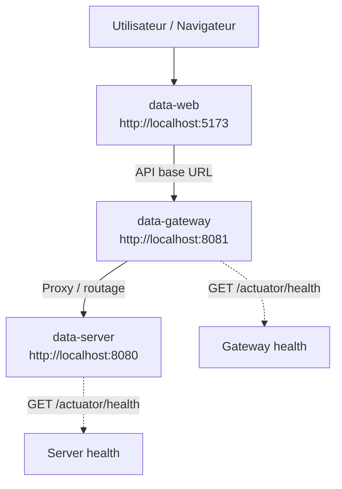
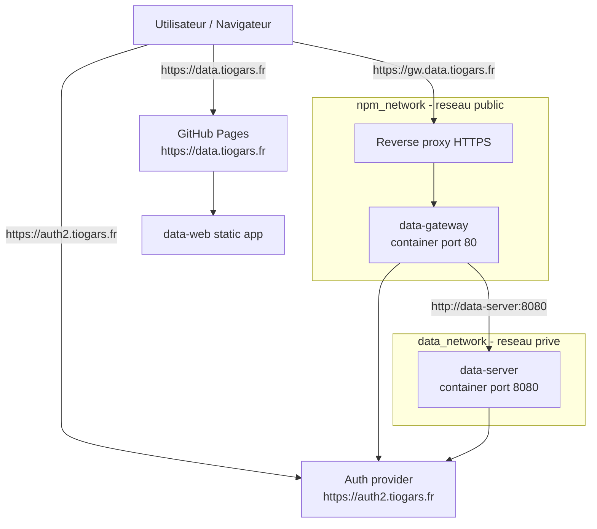

# Data

Plateforme de gestion et d'exposition de donnees, construite comme un mono-repo full stack avec un frontend React, une gateway Spring Cloud, une API Spring Boot et une application Android Flutter.

Le projet assemble trois objectifs pratiques:

- exposer une API metier documentee,
- securiser et superviser les acces via une gateway,
- proposer une interface web et une documentation consultables en local comme en deploiement public.

## Apercu

### Ce que contient le mono-repo

| Module | Role | Stack |
| --- | --- | --- |
| `data-web` | Interface utilisateur | React 19, Vite, MUI, Redux Toolkit |
| `data-gateway` | Point d'entree HTTP | Spring Boot, Spring Cloud Gateway |
| `data-server` | API et acces aux donnees | Spring Boot, Spring Data JPA, PostgreSQL |
| `docs` | Documentation produit/technique | MkDocs |
| `flutter_application` | Application mobile Android | Flutter, Dart, SQLite |

### Stack principale

- Frontend: React, TypeScript, Vite, MUI
- Backend: Spring Boot 4, Spring Data JPA, Springdoc OpenAPI
- Gateway: Spring Cloud Gateway MVC, OAuth2 Resource Server, Bucket4j
- Mobile: Flutter, Dart, SQLite (stockage local + synchro serveur)
- Infra locale: Docker Compose, PostgreSQL, Grafana LGTM, MkDocs

## Demarrage rapide

### Prerequis

- Docker et Docker Compose
- Java 25
- Node.js compatible avec `pnpm`
- `pnpm`
- Les reseaux Docker externes `data_network` et `npm_network` s'ils ne sont pas deja presents

### Lancer tout l'environnement local

Depuis la racine du repository:

```powershell
docker compose up --build --watch
```

Services disponibles ensuite:

- Application web: [http://localhost:5173](http://localhost:5173)
- Gateway API: [http://localhost:8081](http://localhost:8081)
- API server: [http://localhost:8080](http://localhost:8080)
- Documentation MkDocs: [http://localhost:8000/data/](http://localhost:8000/data/)
- Observabilite Grafana LGTM: [http://localhost:3000/](http://localhost:3000/)

### Lancer les modules separement

Frontend:

```powershell
pnpm -C data-web install
pnpm -C data-web dev
```

API server:

```powershell
.\data-server\mvnw.cmd -f data-server\pom.xml spring-boot:run
```

Gateway:

```powershell
.\data-gateway\mvnw.cmd -f data-gateway\pom.xml spring-boot:run
```

Application Android (Flutter):

```powershell
Push-Location flutter_application
flutter pub get
flutter run -d emulator-5554
Pop-Location
```

## Architecture

### Developpement local



### Deploiement public



URLs publiques:

- Application web: [https://data.tiogars.fr](https://data.tiogars.fr)
- Gateway: [https://gw.data.tiogars.fr](https://gw.data.tiogars.fr)

Hypotheses de deploiement:

- le frontend est publie via GitHub Pages avec `data-web/public/CNAME`,
- le build frontend force `VITE_API_BASE_URL=https://gw.data.tiogars.fr`,
- la gateway ecoute sur le port `80` dans le conteneur avec le profil `docker`,
- la communication inter-services se fait sur `data_network`.

## Reperes utiles

### Endpoints locaux

- Gateway health: [http://localhost:8081/actuator/health](http://localhost:8081/actuator/health)
- Server health: [http://localhost:8080/actuator/health](http://localhost:8080/actuator/health)
- OpenAPI server: [http://localhost:8080/v3/api-docs](http://localhost:8080/v3/api-docs)
- OpenAPI gateway: [http://localhost:8081/v3/api-docs](http://localhost:8081/v3/api-docs)
- Swagger UI server: [http://localhost:8080/swagger-ui.html](http://localhost:8080/swagger-ui.html)
- Swagger UI gateway: [http://localhost:8081/swagger-ui.html](http://localhost:8081/swagger-ui.html)

### Arborescence

```text
.
|-- data-web/       # frontend React
|-- data-gateway/   # gateway HTTP et securite
|-- data-server/    # API Spring Boot et persistence
|-- flutter_application/ # application Android Flutter
|-- docs/           # documentation MkDocs
`-- docker-compose.yml
```

## Developpement

### Frontend

Commandes principales:

```powershell
pnpm -C data-web install
pnpm -C data-web dev
pnpm -C data-web build
pnpm -C data-web lint
```

### Generation du client API

Les services frontend sont generes a partir de la specification OpenAPI du backend.

Principes a respecter:

- ne pas modifier manuellement les fichiers generes,
- le fichier genere principal est `data-web/src/services/sectionApi.ts`,
- la source de verite reste le contrat OpenAPI backend et la configuration de codegen.

Commandes:

```powershell
pnpm -C data-web run openapi:pull
pnpm -C data-web run rtk:codegen
pnpm -C data-web run generate:apis
```

### Backend

Build Maven:

```powershell
.\data-server\mvnw.cmd -f data-server\pom.xml test
.\data-gateway\mvnw.cmd -f data-gateway\pom.xml test
```

Variables d'environnement utiles pour la gateway:

- `DATA_SERVER_URL` par defaut `http://localhost:8080`
- `DATA_GATEWAY_RATE_LIMIT_CAPACITY` par defaut `120`
- `DATA_GATEWAY_RATE_LIMIT_PERIOD` par defaut `PT1M`
- `DATA_GATEWAY_RATE_LIMIT_TOKENS` par defaut `1`

### Mobile Android (Flutter)

Commandes principales:

```powershell
Push-Location flutter_application
flutter pub get
flutter analyze
flutter test
flutter run -d emulator-5554
flutter build apk --debug
Pop-Location
```

Documentation mobile:

- `flutter_application/README.md`
- `flutter_application/DEVELOPMENT.md`
- `docs/1-features/1.3-mobile/`
- `docs/2-development/instructions/07-mobile-flutter.md`

## Documentation

La documentation fonctionnelle et technique est maintenue avec MkDocs dans le dossier `docs`.

Pour la consulter localement:

```powershell
docker compose up mkdocs
```

## Pourquoi ce projet

Ce repository sert a centraliser une chaine complete autour de la donnee: exposition API, securisation des acces, interface web, documentation et observabilite. Il peut servir a la fois de base de travail produit, de bac a sable d'architecture moderne et de support de documentation vivante.
