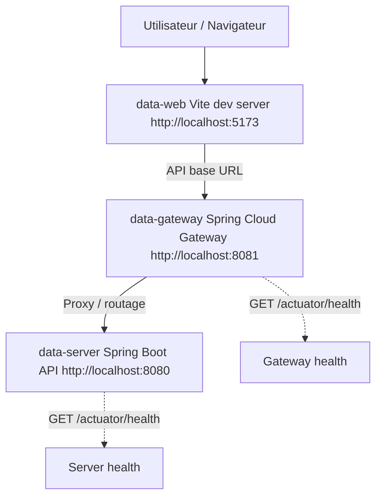
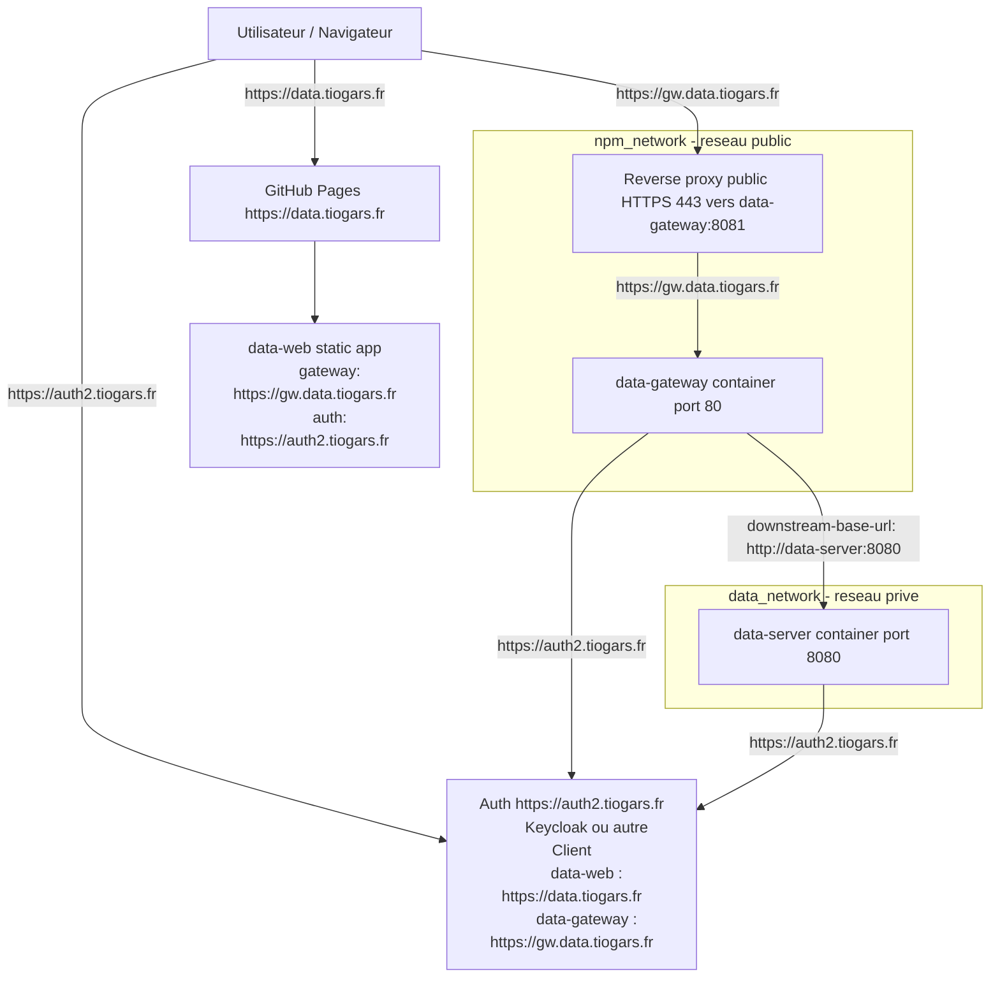

# Data

Data est un outil pour gérer de la donnée.

## Architecture des composants

### Local (developpement)



URLs locales principales:

- Web: [http://localhost:5173](http://localhost:5173)
- Gateway API: [http://localhost:8081](http://localhost:8081)
- Server API: [http://localhost:8080](http://localhost:8080)

### Public (GitHub Pages + Docker)



URLs publiques:

- Web: [https://data.tiogars.fr](https://data.tiogars.fr)
- Gateway: [https://gw.data.tiogars.fr](https://gw.data.tiogars.fr)

Parametrage public attendu:

- Le frontend est servi par GitHub Pages via `data-web/public/CNAME`.
- Le build GitHub Pages force `VITE_API_BASE_URL=https://gw.data.tiogars.fr`.
- La gateway est publiee sur le reseau `npm_network` et repond sur le port `80` dans le conteneur (profil docker).
- La gateway route ensuite les appels vers `data-server:8080` via le reseau prive `data_network`.

Compose local associe (pour garder localhost:8081):

- Mapping gateway: `8081:80`

## Links

- [http://localhost:8080](http://localhost:8080)
- [http://localhost:8081](http://localhost:8081)
- [http://localhost:8081/actuator/health](http://localhost:8081/actuator/health)
- [http://localhost:8080/actuator/health](http://localhost:8080/actuator/health)
- [http://localhost:8080/v3/api-docs](http://localhost:8080/v3/api-docs)
- [http://localhost:8081/v3/api-docs](http://localhost:8081/v3/api-docs)
- [http://localhost:3000/](http://localhost:3000/)
- [http://localhost:8080/swagger-ui.html](http://localhost:8080/swagger-ui.html)
- [http://localhost:8081/swagger-ui.html](http://localhost:8081/swagger-ui.html)
- [http://localhost:5173/](http://localhost:5173/)
- [http://localhost:8000/data/](http://localhost:8000/data/)

## Documentation

```bash
docker compose -f '.\docker-compose.yml' up --build --watch
```

## Web

```bash
pnpm install
pnpm dev
pnpm build
pnpm run generate:section-api
pnpm upgrade -i --latest
pnpm add @mui/react-data-grid
```

## API Client Generation (data-web)

Les services API frontend sont générés à partir de la spec OpenAPI backend.

- Ne pas modifier manuellement les fichiers générés.
- Fichier généré principal: data-web/src/services/sectionApi.ts
- Exécuter depuis data-web:

```bash
pnpm run openapi:pull
pnpm run rtk:codegen:section
```

Pipeline complet:

```bash
pnpm run generate:section-api
```

## Server

- [https://www.baeldung.com/spring-rest-openapi-documentation](https://www.baeldung.com/spring-rest-openapi-documentation)

## Gateway

```bash
cd data-gateway
./mvnw spring-boot:run
```

Profil docker (gateway cible automatiquement le service `data-server` via `http://data-server:8080`):

```bash
docker compose up --build data-server data-gateway
```

Variables d'environnement supportees:

- `DATA_SERVER_URL` (defaut: `http://localhost:8080`)
- `DATA_GATEWAY_RATE_LIMIT_CAPACITY` (defaut: `120`)
- `DATA_GATEWAY_RATE_LIMIT_PERIOD` (defaut: `PT1M`)
- `DATA_GATEWAY_RATE_LIMIT_TOKENS` (defaut: `1`)
